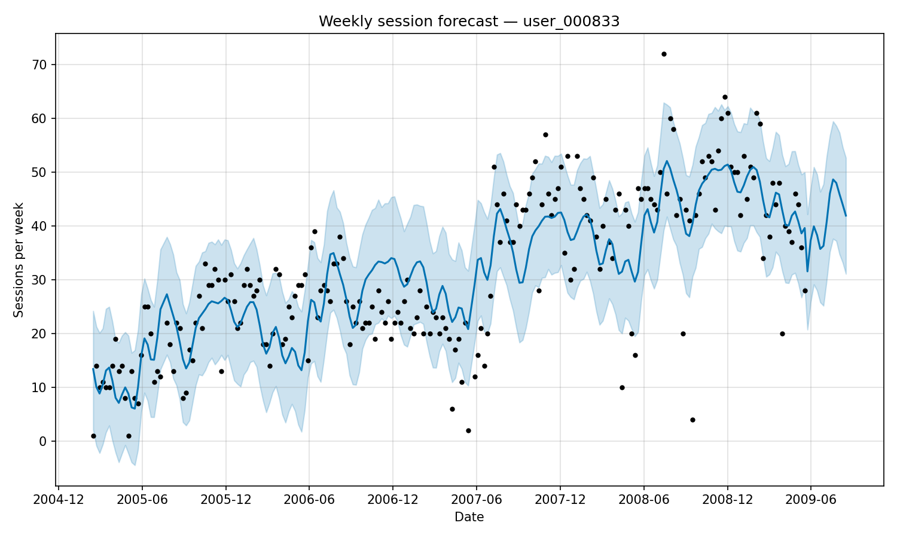

# Behaviour Forecast

Who is the most active listener in the dataset, and how much will they listen in the next 3 months?

## What I did

The dataset has 1,000 users and 19 million play events. The first step is grouping those plays into sessions — a session ends when more than 20 minutes pass between two songs (same rule as [Exercise 2](../exercise2/)). From there, counting sessions per user gives us the **user_000833** as the winner, with **6,897 sessions** between 2005 and 2009.

To forecast their future activity, I aggregated their sessions by week and fed that time series into [Prophet](https://facebook.github.io/prophet/), Meta's open-source forecasting library. Weekly granularity works better than daily here as daily counts are noisy and have a lot of empty days. Weekly totals give us a clear and consistent signal.

Prophet fits a trend and seasonality model and outputs a prediction with confidence intervals. The horizon is 13 weeks, roughly 3 months out.

## Results

**user_000833's** listening grew steadily from 2005 to late 2008, then levelled off. The model projects **35–45 sessions per week** going forward.



Full forecast in [`output/forecast.tsv`](output/forecast.tsv).

## Running it

```bash
pip install -r requirements.txt
python forecast.py
# outputs: output/forecast.tsv, output/forecast_plot.png
```

## References

- [Prophet documentation](https://facebook.github.io/prophet/docs/quick_start.html)
- [Last.fm 1K Dataset](http://ocelma.net/MusicRecommendationDataset/lastfm-1K.html)
- [`../data/README.txt`](../data/README.txt) — dataset format and column definitions
